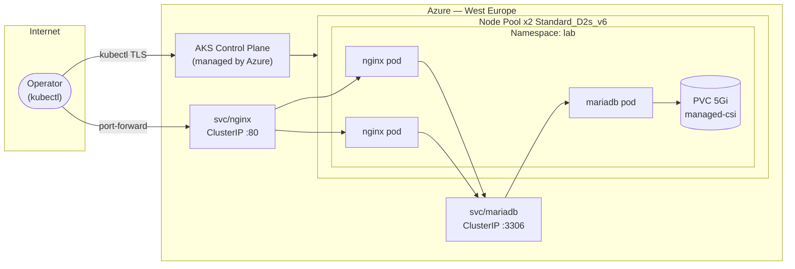

## Cluster Status

| | |
|---|---|
| **Platform** | Azure Kubernetes Service (AKS) |
| **Region** | West Europe (Amsterdam) |
| **Kubernetes** | v1.34.7 |
| **Nodes** | 2 × Standard_D2s_v6 (2 vCPU / 8 GB) |
| **OS** | Ubuntu 22.04 LTS |
| **Status** | ✅ Running |

---

## Nodes

| Name | Status | Version | OS |
|------|--------|---------|-----|
| aks-nodepool1-…-000000 | ✅ Ready | v1.34.7 | Ubuntu 22.04 |
| aks-nodepool1-…-000001 | ✅ Ready | v1.34.7 | Ubuntu 22.04 |

---

## Workloads — namespace: `lab`

| Pod | Image | Replicas | Status |
|-----|-------|----------|--------|
| nginx | nginx:1.27-alpine | 2 | ✅ Running |
| mariadb | mariadb:10.11 | 1 | ✅ Running |

### Resource allocations

| Container | CPU request | CPU limit | Memory request | Memory limit |
|-----------|-------------|-----------|----------------|--------------|
| nginx | 100m | 200m | 64Mi | 128Mi |
| mariadb | 250m | 500m | 256Mi | 512Mi |

---

## Services

| Name | Type | Port | Exposure |
|------|------|------|----------|
| nginx | ClusterIP | 80 | Internal only |
| mariadb | ClusterIP | 3306 | Internal only |

No LoadBalancer services — zero public endpoints. Access via `kubectl port-forward`.

---

## Persistent Storage

| Name | StorageClass | Capacity | Mode | Status |
|------|-------------|----------|------|--------|
| mariadb-data | managed-csi | 5 Gi | ReadWriteOnce | ✅ Bound |

Azure Disk CSI driver provisions the volume automatically and supports snapshots for backup and DR.

---

## Architecture



---

## Security Design

| Principle | Implementation |
|-----------|----------------|
| No public endpoints | All services are ClusterIP — no LoadBalancer or NodePort |
| Secrets management | Database credentials stored as Kubernetes Secrets, not in manifests |
| Least privilege | `appuser` has DML on `appdb` only; `monitor` user is read-only |
| Resource limits | CPU and memory limits on all containers — prevents OOMKill cascades |
| Health probes | Liveness + readiness probes on nginx and MariaDB |
| RBAC | Enabled cluster-wide with managed identity |

---

## Tech Stack

| Component | Version | Role |
|-----------|---------|------|
| Azure Kubernetes Service | 1.34.7 | Managed Kubernetes control plane |
| Nginx | 1.27-alpine | Web / reverse proxy (2 replicas) |
| MariaDB | 10.11 | Relational database |
| Azure Disk CSI | built-in | Persistent storage driver |
| Azure CLI | 2.x | Infrastructure provisioning |
| kubectl | 1.34.7 | Cluster management |

---

## Design Decisions

**Why ClusterIP only?**
Exposing services via LoadBalancer creates a public attack surface. All access goes through `kubectl port-forward`, which authenticates through the AKS API server and logs every session.

**Why 2 Nginx replicas?**
Demonstrates pod scheduling across nodes, rolling updates, and how Kubernetes routes traffic via kube-proxy. In production a HorizontalPodAutoscaler would manage replica count based on load.

**Why managed-csi for storage?**
Azure Disk CSI is the default StorageClass in AKS. It provisions Azure Managed Disks automatically and supports volume snapshots — directly relevant to backup and DR workflows.

---

## Key Commands

```bash
# Get cluster credentials
az aks get-credentials --resource-group lab-rg --name lab-aks

# Check node and pod status
kubectl get nodes
kubectl get pods -n lab -o wide

# Access nginx locally
kubectl port-forward svc/nginx -n lab 8080:80

# Check MariaDB connectivity
kubectl exec -n lab deployment/nginx -- \
  mariadb -h mariadb -u appuser -p --skip-ssl appdb -e "SELECT NOW();"

# Scale nginx
kubectl scale deployment nginx -n lab --replicas=3

# Roll back a deployment
kubectl rollout undo deployment/nginx -n lab

# View events (useful for debugging)
kubectl get events -n lab --sort-by='.lastTimestamp'
```
