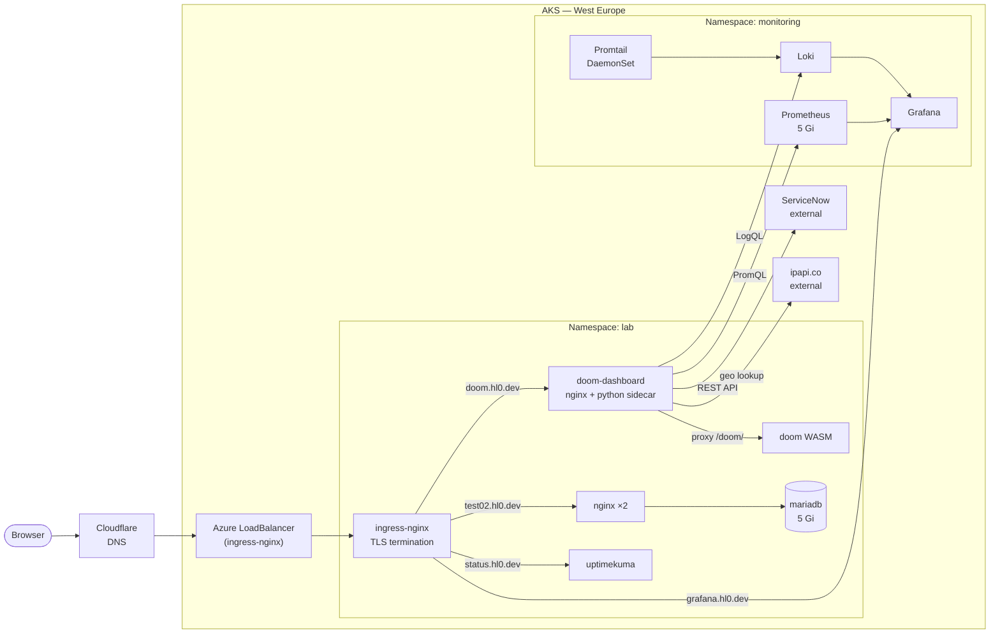

## Cluster

| | |
|---|---|
| **Platform** | Azure Kubernetes Service (AKS), Free SKU tier |
| **Region** | West Europe (Amsterdam) |
| **Node pool** | 2 × Standard_D2s_v6 — 2 vCPU / 8 GB each |
| **OS** | Ubuntu 22.04 LTS |

**Live endpoints**

| URL | Service |
|-----|---------|
| [doom.hl0.dev](https://doom.hl0.dev) | DOOM ops dashboard (game + live cluster metrics + ServiceNow) |
| [grafana.hl0.dev](https://grafana.hl0.dev) | Grafana — Prometheus + Loki datasources |
| [test02.hl0.dev](https://test02.hl0.dev) | nginx |
| [status.hl0.dev](https://status.hl0.dev) | Uptime Kuma |

---

## Workloads

### Namespace: `lab`

| Deployment | Image | Replicas | Exposed at |
|---|---|---|---|
| nginx | nginx:1.27-alpine | 2 | test02.hl0.dev |
| mariadb | mariadb:10.11 | 1 | ClusterIP only |
| doom | scottlawsonbc/doom-wasm | 1 | via doom-dashboard proxy |
| doom-dashboard | nginxinc/nginx-unprivileged:1.27-alpine + python:3.12-alpine | 1 | doom.hl0.dev |
| uptimekuma | louislam/uptime-kuma:1 | 1 | status.hl0.dev |

### Namespace: `monitoring`

| Component | Source | Role |
|---|---|---|
| Prometheus | kube-prometheus-stack | Metrics — 7-day retention, 5 Gi PVC |
| Grafana | kube-prometheus-stack | Dashboards — Prometheus + Loki datasources |
| node-exporter | kube-prometheus-stack | Host-level CPU / memory / disk metrics |
| kube-state-metrics | kube-prometheus-stack | Kubernetes object state metrics |
| Loki | loki-stack | Log aggregation |
| Promtail | loki-stack | Log shipping (DaemonSet on every node) |

### Supporting namespaces

| Namespace | Component | Role |
|---|---|---|
| ingress-nginx | ingress-nginx controller | Azure LoadBalancer → TLS termination → pod routing |
| cert-manager | cert-manager | Automated Let's Encrypt TLS via Cloudflare DNS-01 |

---

## Architecture



---

## Security

| Layer | Implementation |
|-------|----------------|
| TLS | cert-manager + Let's Encrypt DNS-01 (Cloudflare), HSTS on all endpoints |
| Network | Default-deny `NetworkPolicy` in `lab`; per-workload ingress/egress allow rules |
| Containers | `runAsNonRoot`, `readOnlyRootFilesystem`, `allowPrivilegeEscalation: false`, `seccompProfile: RuntimeDefault` |
| Secrets | Kubernetes Secrets for all credentials; GitHub Actions secrets for CI — nothing hardcoded in manifests |
| Ingress | `allowSnippetAnnotations: false` (ingress-nginx safe default) |

---

## Storage

| PVC | Namespace | Size | Consumer |
|-----|-----------|------|----------|
| mariadb-data | lab | 5 Gi | MariaDB |
| uptimekuma-data | lab | 1 Gi | Uptime Kuma |
| grafana | monitoring | 2 Gi | Grafana |
| prometheus-db | monitoring | 5 Gi | Prometheus |

---

## Key commands

```bash
# Get cluster credentials
az aks get-credentials --resource-group lab-rg --name lab-aks

# Check everything
kubectl get pods,svc,pvc,ingress -n lab
kubectl get pods -n monitoring

# Certificate status
kubectl get certificate -A

# Tail doom-dashboard metrics sidecar logs (Prometheus + SNOW + geo)
kubectl logs -n lab deployment/doom-dashboard -c metrics -f

# Force-reload ConfigMap changes in doom-dashboard
kubectl rollout restart deployment/doom-dashboard -n lab

# Scale nginx
kubectl scale deployment nginx -n lab --replicas=3
```
